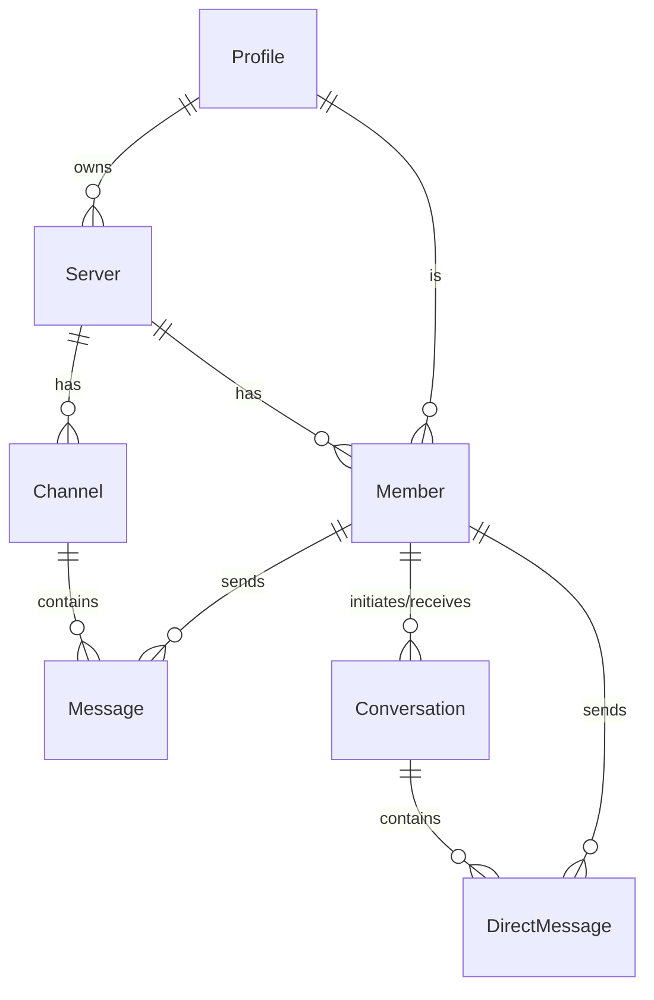

# Discloned

A full-stack, real-time clone of Discord built with modern web technologies. This application replicates core Discord features including servers, channels (text, voice, video), direct messaging, member roles, and file attachments.

**[Link to Live Demo]** (Add your deployment link here)

## ✨ Features

- **Server Management**: Create and manage servers, generate invite links.
- **Channels**: Create text, audio, and video channels within servers.
- **Real-time Chat**: Instant messaging in channels and direct messages with Socket.io.
- **Audio/Video Calls**: WebRTC-based communication using LiveKit.
- **User Authentication**: Secure user sign-up and sign-in with Clerk.
- **Member Roles**: Assign roles (Admin, Moderator, Guest) to server members.
- **File Uploads**: Send file attachments in messages via UploadThing.
- **Rich Media**: Emoji support and message formatting.
- **Modern UI**: Responsive and beautiful interface built with Tailwind CSS and Shadcn/UI.

## 🛠️ Technologies Used

This project leverages a powerful and modern stack for a robust and scalable application.

- **Framework**: [Next.js 15](https://nextjs.org/) (with App Router & Turbopack)
- **Language**: [TypeScript](https://www.typescriptlang.org/)
- **Styling**: [Tailwind CSS](https://tailwindcss.com/)
- **UI Components**: [Shadcn/UI](https://ui.shadcn.com/), [Radix UI](https://www.radix-ui.com/), [Lucide React](https://lucide.dev/guide/packages/lucide-react) for icons.
- **Database ORM**: [Prisma](https://www.prisma.io/)
- **Database**: [PostgreSQL](https://www.postgresql.org/) (e.g., via [Supabase](https://supabase.com/))
- **Authentication**: [Clerk](https://clerk.com/)
- **Real-time Communication**:
  - [Socket.io](https://socket.io/) for messaging.
  - [LiveKit](https://livekit.io/) for audio/video streams.
- **File Uploads**: [UploadThing](https://uploadthing.com/)
- **State Management**: [Zustand](https://github.com/pmndrs/zustand)
- **Form Handling**: [React Hook Form](https://react-hook-form.com/) & [Zod](https://zod.dev/) for validation.
- **Data Fetching**: [TanStack Query (React Query)](https://tanstack.com/query/latest)

## 🗄️ Database Architecture

The database schema is designed to model the core entities of a chat application like Discord. Prisma is used to interact with the PostgreSQL database, ensuring type-safe queries.

Here are the primary models:

- **`Profile`**: Represents a registered user.
- **`Server`**: A server/guild that contains channels and members.
- **`Member`**: Represents a user's connection to a server, including their role.
- **`Channel`**: A text, audio, or video channel within a server.
- **`Message`**: A message sent within a channel.
- **`Conversation`**: A private conversation between two members.
- **`DirectMessage`**: A message sent within a private conversation.

Below is an Entity-Relationship Diagram illustrating the database schema:



## 🚀 Getting Started

Follow these instructions to set up the project locally for development and testing.

### Prerequisites

- [Node.js](https://nodejs.org/en/) (v20.x or higher recommended)
- `npm`, `yarn`, or `pnpm` package manager.
- A [PostgreSQL](https://www.postgresql.org/download/) database. You can easily set one up for free on [Supabase](https://supabase.com/).
- Accounts for [Clerk](https://clerk.com/), [UploadThing](https://uploadthing.com/), and [LiveKit](https://livekit.io/).

### 1. Clone the Repository

```bash
git clone https://github.com/<your-username>/discloned.git
cd discloned
```

_(Replace `<your-username>` with your GitHub username or the appropriate repository URL)_

### 2. Install Dependencies

Install the project dependencies using your preferred package manager:

```bash
npm install
# or
yarn install
# or
pnpm install
```

### 3. Set Up Environment Variables

Create a file named `.env.local` in the root of the project by copying the example below. Fill in the values with your credentials from the services mentioned in the prerequisites.

```env
# .env.local

# --- Database ---
# Get from your PostgreSQL provider (e.g., Supabase)
# The `directUrl` is for Prisma migrations and studio, while `DATABASE_URL` is for the application connection pool.
DATABASE_URL="postgresql://<user>:<password>@<host>/<dbname>?sslmode=require"
DIRECT_URL="postgresql://<user>:<password>@<host>/<dbname>?pgbouncer=true&connection_limit=1"

# --- Authentication (Clerk) ---
# Get these from your Clerk dashboard: https://dashboard.clerk.com/
NEXT_PUBLIC_CLERK_PUBLISHABLE_KEY=
CLERK_SECRET_KEY=

# --- File Uploads (UploadThing) ---
# Get these from your UploadThing dashboard: https://uploadthing.com/
UPLOADTHING_SECRET=
UPLOADTHING_APP_ID=

# --- Real-time Video/Audio (LiveKit) ---
# Get these from your LiveKit Cloud project settings: https://cloud.livekit.io/
LIVEKIT_API_KEY=
LIVEKIT_API_SECRET=
NEXT_PUBLIC_LIVEKIT_URL="https://<your-project-slug>.livekit.cloud/"

# --- Application URL ---
# The canonical URL of your deployment.
# Required for webhooks and other absolute URL generation.
# Use http://localhost:3000 for local development.
NEXT_PUBLIC_APP_URL="http://localhost:3000"
```

### 4. Set Up the Database

Run the following command to sync the Prisma schema with your PostgreSQL database. This will create the necessary tables and relations.

```bash
npx prisma db push
```

### 5. Run the Development Server

Now you can start the development server:

```bash
npm run dev
```

The application should now be running at [http://localhost:3000](http://localhost:3000).

---

Happy coding!
